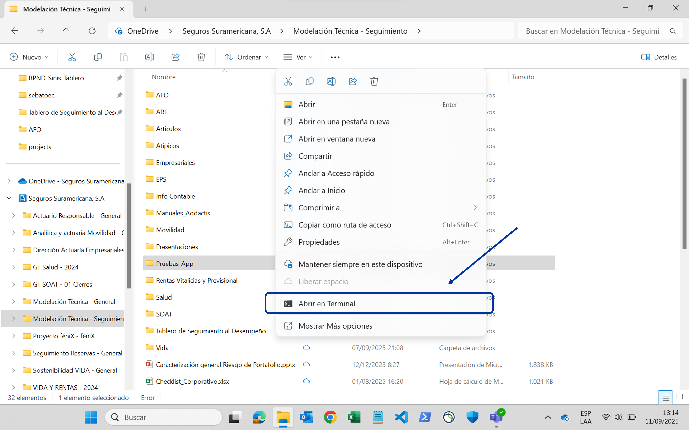
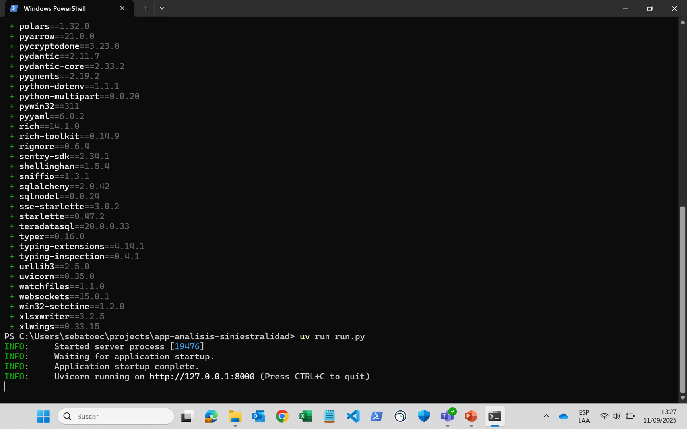
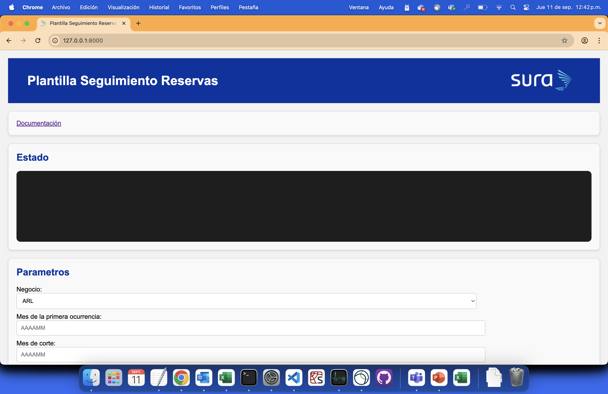

# Aplicación para análisis de siniestralidad

Click [aquí](https://sebastobone.github.io/app-analisis-siniestralidad/) para acceder a la documentación completa en línea.

<!--docs-intro-start-->

Esta aplicación permite realizar **análisis de siniestralidad última** mediante metodologías de triángulos y entremés.

## Funcionalidades

- **Extraer información** de siniestros, primas, y expuestos desde **Teradata**.
- **Cargar manualmente información** de siniestros, primas, y expuestos.
- **Cuadrar contablemente** siniestros y primas.
- **Generar automáticamente** controles y reportes SOX.
- **Estimar la frecuencia, severidad, y siniestralidad** por metodologías de **triángulos** o **entremés** desde plantillas de Excel.
- **Almacenar y garantizar la trazabilidad** de criterios y justificaciones del análisis.
- **Consolidar resultados y generar informes**.

## Requisitos

- **[Git](https://git-scm.com/):** para descargar y actualizar la aplicación.
- **[uv](https://docs.astral.sh/uv/getting-started/installation/):** para la gestión de librerías.
- **Microsoft Excel:** para crear las plantillas y realizar los análisis.
- **Acceso a Teradata:** necesario si se desea extraer información directamente de esta fuente.

!!! tip
    Git y uv no requieren permisos de administrador para ser instalados.

## Ejecutar la app

1. Elija una carpeta para almacenar el análisis. Haga clic derecho sobre ella y seleccione **Abrir en Terminal**:

    

2. En la terminal, copie y ejecute los siguientes comandos:

    ```sh
    git clone https://github.com/sebastobone/app-analisis-siniestralidad.git
    cd app-analisis-siniestralidad
    uv sync
    uv run run.py
    ```

    Una vez finalicen, la terminal se verá así:

    

3. Abra su navegador e ingrese la URL que aparece en la terminal (_INFO: Uvicorn running on..._). Debería ver una página como esta:

    

    !!! info
        Esta URL es local a su computador, por lo tanto, sólo usted puede acceder.

¡Eso es todo! Ahora puede proceder con la [**configuración del análisis**](docs/config/segmentacion.md).

!!! note "Nota"
    Mantenga la terminal abierta mientras utiliza la aplicación.
