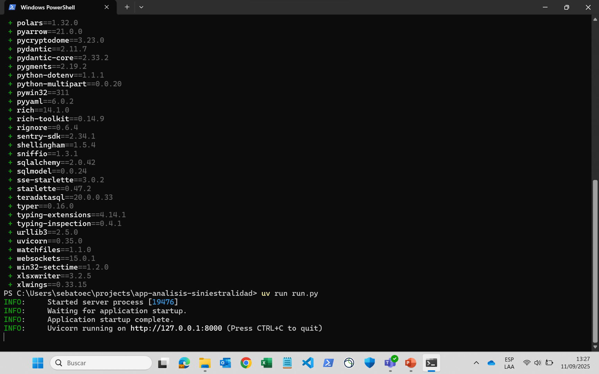
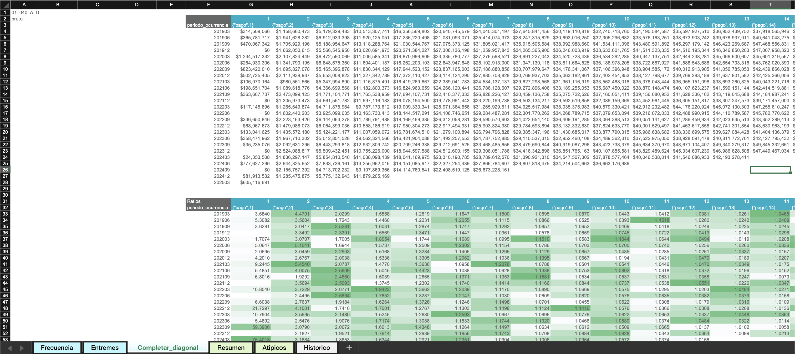

<!--markdownlint-disable MD007 MD046-->

# Guía para auditores

## Insumos de negocio

Para su revisión, el negocio le entregará:

- La carpeta donde desarrolló el análisis. La estructura de esta carpeta se describe en la [guía de estructura](estructura.md).
- Los parámetros utilizados:
    - Negocio.
    - Mes de la primera ocurrencia.
    - Mes de corte.
    - Tipo de análisis.
    - Aproximar reaseguro.
    - Añadir fraude a siniestros (SOAT).
    - Nombre de la plantilla.
- En caso de análisis de triángulos, el tipo de estimación realizada (**Frecuencia y Severidad** o **Plata**).

!!! nota "Múltiples revisiones"
    Si debe auditar **más de un análisis**, el negocio le entregará una carpeta y parámetros para cada uno.

    - Ejemplo: si va a revisar un análisis de triángulos y otro de entremés, recibirá **dos carpetas** con sus respectivos parámetros.
    - En cada conjunto de parámetros se debe indicar el **tipo de análisis** (triángulos o entremés) y el nombre de la plantilla correspondiente.
    
    El proceso descrito en esta guía asume una sola revisión. Para múltiples revisiones, simplemente **repita los pasos** con la carpeta y parámetros de cada análisis.

## Ejecutar la app

Para ejecutar la app, siga los siguientes pasos:

1. Asegúrese de tener instalado en su equipo [uv](https://docs.astral.sh/uv/getting-started/installation/) y Microsoft Excel.
2. En el explorador de archivos, haga clic derecho sobre la carpeta del análisis y seleccione **“Abrir en terminal”**.

    

3. Ejecute los siguientes comandos en la terminal:

    ```sh
    uv sync
    uv run run.py
    ```

    Una vez terminen de ejecutar, la terminal se verá así:

    

    !!! tip
        Si le sale un error al ejecutar estos comandos, consulte la solución en la [guía de problemas frecuentes](faq.md).

4. Abra su navegador e ingrese a la URL indicada en la terminal (_INFO: Uvicorn running on..._). Debería ver una página como esta:

    

    !!! info
        Esta URL es propia de su computador, por lo tanto, sólo usted puede acceder.

## Ingresar parámetros de negocio

En la página verá la siguiente sección:


1. Ingrese los parámetros comunicados por el negocio.
2. Presione **"Guardar parámetros"**.

## Abrir el libro de trabajo

1. En la interfaz web, diríjase a la sección **“Plantilla”**.

    

2. Presione **"Generar aperturas"**.
3. Presione **"Abrir plantilla"**.

Esto abrirá una copia de la plantilla de Excel donde el negocio realizó sus estimaciones. A partir de aquí, podrá acceder a los criterios de estimación empleados.

## Análisis de triángulos

El negocio puede haber aplicado una de estas dos metodologías:

- **Frecuencia y Severidad**: la siniestralidad última se obtiene como el producto de ambas.
- **Plata**: la siniestralidad última se calcula directamente.

El procedimiento de revisión es el mismo en ambos casos:

- Si se utilizó **Frecuencia y Severidad**, las hojas relevantes serán **"Frecuencia"** y **"Severidad"**.
- Si se utilizó **Plata**, la hoja relevante será **"Plata"**.

!!! tip
    Para entender la estructura de las hojas de análisis, consulte la [guía de uso de triángulos](uso/triangulos.md).

### Revisión de apertura

En la interfaz web:

1. Seleccione la **apertura** y el **atributo** que desea revisar.
2. Seleccione la **plantilla** que corresponda a la metodología aplicada.
3. Presione el botón **Traer**.

!!! example "Ejemplo"
    El negocio **Movilidad** comunicó que utilizó la metodología de **Plata**. Como auditor, iniciaré la revisión en la apertura **01_040_MOTOS RESTO_MOTOS RESTO** para el atributo **bruto**. Debo seleccionar lo siguiente y luego presionar **Traer**:
    

!!! tip
    Si le sale un error de OneDrive/SharePoint al presionar **Traer**, consulte la solución en la [guía de problemas frecuentes](faq.md#2-error-de-onedrivesharepoint).

Los criterios de estimación del negocio están en:

#### Factores excluidos


#### Estadísticos de factores

- Ventanas de tiempo para estadísticos
- Vector de factores seleccionados


#### Triángulo base


#### Tabla resumen

- Metodología de pago o incurrido
- Ultimate por ocurrencia
- Metodología por ocurrencia
- Indicador por ocurrencia
- Comentarios por ocurrencia


En la hoja **“Resumen”** encontrará los resultados consolidados de siniestralidad para todas las aperturas.

!!! note "Nota"
    Para cambiar de apertura, repita el proceso: seleccione la nueva apertura en los menús desplegables y presione **"Traer"**.

## Análisis de entremés

### La hoja Entremés


En esta hoja se encuentra el análisis de entremés completo. Las columnas con los criterios definidos por el negocio están sombreadas en **gris**.

!!! note "Nota"
    A diferencia de las hojas de triángulos, esta hoja tiene la información de todas las aperturas, por lo que no es necesario usar el botón **Traer**.

### La hoja Completar_diagonal



Si el negocio utilizó la metodología [**Completar diagonal**](uso/entremes.md#1-completar-diagonal-violeta) en alguna apertura, podrá revisar los parámetros y criterios correspondientes en esta hoja. Para ello:

1. Seleccione en la interfaz web la **apertura** y el **atributo** correspondientes.
2. Presione el botón **Traer**.

!!! tip
    Para entender las estructuras de las hojas **"Entremés"** y **"Completar_diagonal"**, consulte la [guía de uso de entremés](uso/entremes.md).
