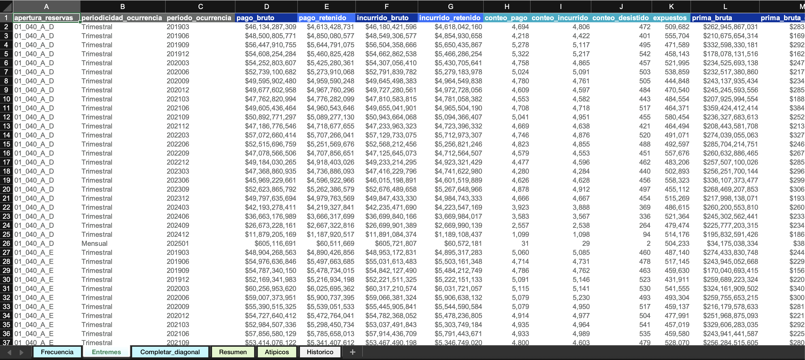
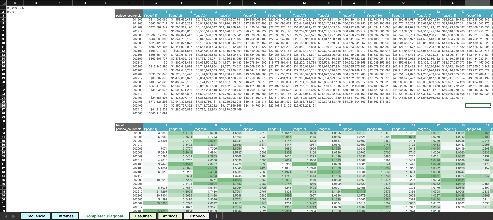

# Revisar entremés

Las hojas relevantes dentro de este análisis son las hojas de **"Entremés"** y **"Completar_diagonal"**.

!!! tip
    Para entender las estructuras de estas hojas, consulte la [guía de uso de entremés](../uso/entremes.md).

## La hoja Entremés

En esta hoja se encuentra el análisis de entremés completo. Las columnas con los criterios definidos por el negocio están sombreadas en **gris**.

!!! note "Nota"
    A diferencia de las hojas de triángulos, esta hoja tiene la información de todas las aperturas, por lo que no es necesario usar el botón **Traer**.

## La hoja Completar_diagonal

Si el negocio utilizó la metodología [**Completar diagonal**](../uso/entremes.md#1-completar-diagonal-violeta) en alguna apertura, podrá revisar los parámetros y criterios correspondientes en esta hoja. Para ello:

1. Seleccione en la interfaz web la **apertura** y el **atributo** correspondientes.
2. Seleccione la plantilla **Completar_diagonal** en la lista desplegable.
3. Presione el botón **Traer**.
