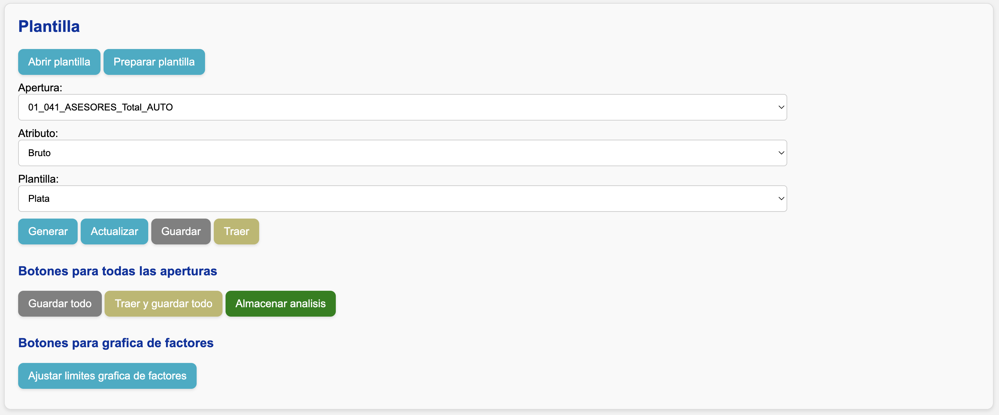

<!--markdownlint-disable MD007 MD046-->

# Guía para auditores

## Insumos de negocio

Para su revisión, el negocio le entregará:

1. La carpeta donde desarrolló el análisis.

    !!! info
        Esta carpeta contiene una aplicación web. En esta guía se le explicará cómo ejecutarla para que pueda hacer su revisión.

        La estructura de la carpeta y la aplicación se describe en la [guía de estructura](../estructura.md).

2. Los parámetros utilizados para configurar el análisis:
    - Negocio.
    - Mes de la primera ocurrencia.
    - Mes de corte.
    - Tipo de análisis.
    - Aproximar reaseguro.
    - Añadir fraude a siniestros (SOAT).
    - Nombre de la plantilla.

3. En caso de análisis de triángulos, el tipo de estimación realizada (**Frecuencia y Severidad** o **Plata**).

4. Archivos adicionales que haya utilizado para las estimaciones, con una explicación de lo que hace y contiene cada uno.

!!! nota "Múltiples revisiones"
    Si debe auditar **más de un análisis**, el negocio le entregará una carpeta y parámetros para cada uno.

    - Ejemplo: si va a revisar un análisis de triángulos y otro de entremés, recibirá **dos carpetas** con sus respectivos parámetros.
    - En cada conjunto de parámetros se debe indicar el **tipo de análisis** (triángulos o entremés) y el nombre de la plantilla correspondiente.
    
    El proceso descrito en esta guía asume una sola revisión. Para múltiples revisiones, simplemente **repita los pasos** con la carpeta y parámetros de cada análisis.

## Abrir el libro de trabajo

1. Asegúrese de tener instalado en su equipo [uv](https://docs.astral.sh/uv/getting-started/installation/) y Microsoft Excel.
2. Siga la [guía de ejecución de la app](../uso/ejecutar_app.md).
3. En la interfaz web verá la siguiente sección:

    

    **Ingrese los parámetros** comunicados por el negocio y presione **"Guardar parámetros"**.

4. En la interfaz web, diríjase a la sección **“Plantilla”**.

    

    Presione **"Generar aperturas"**, y luego presione **"Abrir plantilla"**.

Se abrirá en su pantalla una copia del libro de Excel donde el negocio realizó sus estimaciones. A partir de aquí, podrá acceder a los criterios de estimación empleados.

!!! info
    Este libro de Excel está almacenado en la carpeta :material-folder: `plantillas`, al interior de la carpeta entregada por el negocio.

Dependiendo del **tipo de análisis** que esté revisando, continúe con la [guía de revisión de triángulos](triangulos.md) o con la [guía de revisión de entremés](entremes.md).
