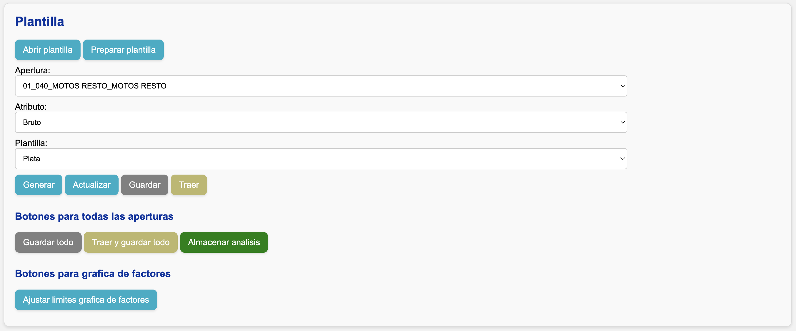
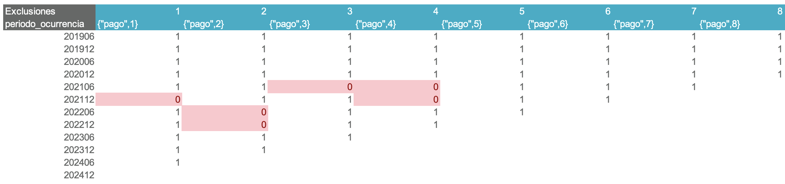
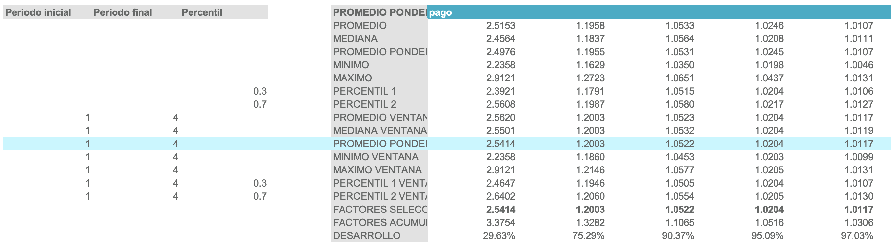
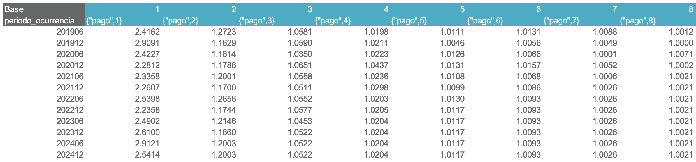
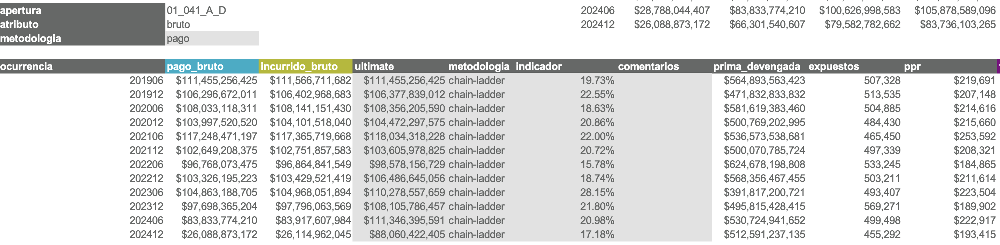

# Revisar triángulos

El negocio puede haber aplicado una de estas dos metodologías:

- **Frecuencia y Severidad**: la siniestralidad última se obtiene como el producto de ambas.
- **Plata**: la siniestralidad última se calcula directamente.

El procedimiento de revisión es el mismo en ambos casos:

- Si se utilizó **Frecuencia y Severidad**, las hojas relevantes serán **"Frecuencia"** y **"Severidad"**.
- Si se utilizó **Plata**, la hoja relevante será **"Plata"**.

Para entender la estructura de las hojas de análisis, consulte la [guía de uso de triángulos](../uso/triangulos.md#estructura-de-la-hoja-de-analisis).

## Revisar una apertura

En la interfaz web:

1. Seleccione la **apertura** y el **atributo** que desea revisar.
2. Seleccione la **plantilla** que corresponda a la metodología aplicada.
3. Presione el botón **Traer**.

!!! example "Ejemplo"
    El negocio **Movilidad** comunicó que utilizó la metodología de **Plata**. Como auditor, iniciaré la revisión en la apertura **01_040_MOTOS RESTO_MOTOS RESTO** para el atributo **bruto**. Debo seleccionar lo siguiente y luego presionar **Traer**:
    

!!! tip
    Si le sale un error de OneDrive/SharePoint al presionar **Traer**, consulte la solución en la [guía de problemas frecuentes](../faq.md#2-error-de-onedrivesharepoint).

Para cambiar de apertura, repita el proceso: seleccione la nueva apertura en los menús desplegables y presione **Traer**.

### Criterios de estimación

#### Factores excluidos

#### Estadísticos de factores

- Ventanas de tiempo para estadísticos
- Vector de factores seleccionados

#### Triángulo base

#### Tabla resumen

- Metodología de pago o incurrido
- Ultimate por ocurrencia
- Metodología por ocurrencia
- Indicador por ocurrencia
- Comentarios por ocurrencia

## Resultados consolidados

En la hoja **“Resumen”** encontrará los resultados consolidados de siniestralidad para todas las aperturas.
