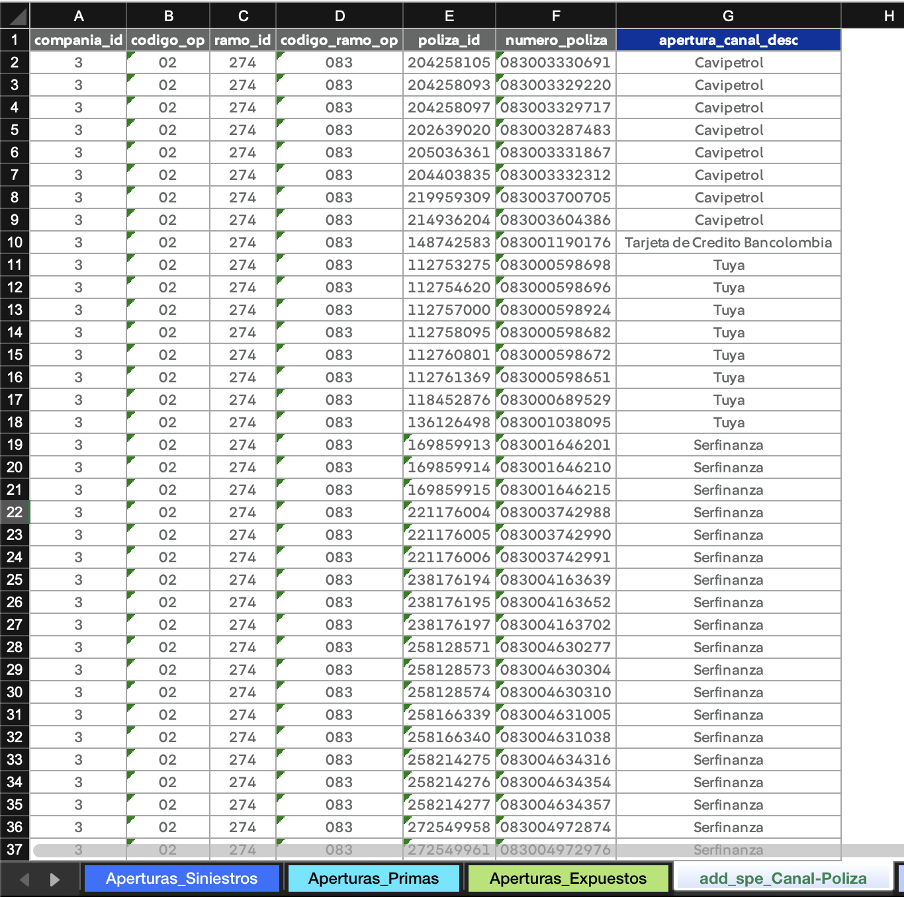

# Construcción de _queries_

Para realizar un análisis de siniestralidad, necesitamos información de siniestros, primas, y expuestos. Uno de los mecanismos provistos por la aplicación para obtener esta información es a través de consultas de Teradata.

A continuación, se describe:

- La estructura mínima que deben tener las salidas de los _queries_.
- Cómo definir las aperturas dentro de sus consultas.

!!! example "Ejemplos"
    Consulte ejemplos reales de [queries utilizados para los cierres contables](https://github.com/sebastobone/app-analisis-siniestralidad/tree/main/data/queries/).

## Estructuras mínimas

Las salidas de las consultas que construya deben contener, como mínimo, las columnas detalladas a continuación.

### Siniestros

| **Nombre de la columna** | **Descripción**                                                   |
| ------------------------ | ----------------------------------------------------------------- |
| codigo_op                | Código de la compañía (01 para Generales, 02 para Vida).          |
| codigo_ramo_op           | Código del ramo.                                                  |
| "columnas de aperturas"  | Por ejemplo: apertura_canal, apertura_amparo, tipo_vehiculo, etc. |
| atipico                  | Binaria: 1 si es un siniestro atípico, 0 si es típico.            |
| fecha_siniestro          | Fecha de ocurrencia del siniestro.                                |
| fecha_registro           | Fecha de movimiento (pago o aviso).                               |
| conteo_pago              | Conteo de siniestros pagados.                                     |
| conteo_incurrido         | Conteo de siniestros incurridos.                                  |
| conteo_desistido         | Conteo de siniestros desistidos.                                  |
| pago_bruto               | Valor del pago bruto.                                             |
| pago_retenido            | Valor del pago retenido.                                          |
| aviso_bruto              | Valor del aviso bruto (movimiento, no saldo).                     |
| aviso_retenido           | Valor del aviso retenido (movimiento, no saldo.)                  |

### Primas

| **Nombre de la columna** | **Descripción**                                                        |
| ------------------------ | ---------------------------------------------------------------------- |
| codigo_op                | Código de la compañía (01 para Generales, 02 para Vida).               |
| codigo_ramo_op           | Código del ramo.                                                       |
| "columnas de aperturas"  | Pueden diferir de las columnas de aperturas de siniestros y expuestos. |
| fecha_registro           | Fecha de movimiento.                                                   |
| prima_bruta              | Valor de la prima bruta.                                               |
| prima_retenida           | Valor de la prima retenida.                                            |
| prima_bruta_devengada    | Valor de la prima bruta devengada.                                     |
| prima_retenida_devengada | Valor de la prima retenida devengada.                                  |

### Expuestos

| **Nombre de la columna** | **Descripción**                                                     |
| ------------------------ | ------------------------------------------------------------------- |
| codigo_op                | Código de la compañía (01 para Generales, 02 para Vida).            |
| codigo_ramo_op           | Código del ramo.                                                    |
| "columnas de aperturas"  | Pueden diferir de las columnas de aperturas de siniestros y primas. |
| fecha_registro           | Fecha de exposición.                                                |
| expuestos                | Número de expuestos del periodo.                                    |
| vigentes                 | Número de vigentes del periodo.                                     |

## Definición de aperturas

### Desde el query (camino sencillo)

Se recomienda si la apertura es sencilla y no depende de otras aperturas. Por ejemplo:

```sql
CASE
    WHEN fas.clase_tarifa_cd IN (2, 3) THEN 'MOTOS'
    WHEN fas.clase_tarifa_cd IN (4, 5, 6) THEN 'UTILITARIOS'
    ELSE 'LIVIANOS'
END AS tipo_vehiculo_desc
```

### Desde el archivo segmentación (camino complejo)

Se recomienda si la apertura tiene una lógica compleja o depende de otras aperturas.

1. Cree una hoja en el archivo de segmentación:

    - El nombre de la hoja debe seguir el siguiente formato: `add_{indicador_cantidad}_{alias_apertura}`.
    - `indicador_cantidad` admite tres posibles valores: `s` para siniestros, `p` para primas, y `e` para expuestos.

    !!! example "Ejemplo"
        Si los siniestros se van a aperturar por amparo, el nombre de la hoja sería `add_s_Amparos`. Si tanto siniestros como primas y expuestos se van a aperturar por esta variable, el nombre sería `add_spe_Amparos`.

2. Cree la tabla con la definicion de la apertura. Ejemplo:

    

    !!! note "Nota"
        Las columnas grises de la imagen corresponden a las columnas como aparecen en Teradata, mientras que la columna azul oscura representa la definición de la apertura creada por el usuario.

3. En el query, cree una tabla volátil para recibir la tabla de apertura:

    ```sql
    CREATE MULTISET VOLATILE TABLE canal_poliza
    (
        compania_id SMALLINT NOT NULL
        , codigo_op VARCHAR(100) NOT NULL
        , ramo_id INTEGER NOT NULL
        , codigo_ramo_op VARCHAR(100) NOT NULL
        , poliza_id BIGINT NOT NULL
        , numero_poliza VARCHAR(100) NOT NULL
        , apertura_canal_desc VARCHAR(100) NOT NULL
    ) PRIMARY INDEX (
        poliza_id, codigo_ramo_op, compania_id
    ) ON COMMIT PRESERVE ROWS;

    INSERT INTO CANAL_POLIZA VALUES (?, ?, ?, ?, ?, ?, ?);

    COLLECT STATISTICS ON canal_poliza INDEX (
        poliza_id, codigo_ramo_op, compania_id
    );
    ```

    !!! tip
        Siempre defina índices primarios y ejecute `COLLECT STATISTICS` para que Teradata optimice el query.

4. Utilice la tabla en el resto de consultas para definir la apertura.

    ```sql
    SELECT
        ...
        , COALESCE(p.apertura_canal_desc, 'RESTO') AS apertura_canal_desc
        ...

    FROM mdb_seguros_colombia.v_hist_polcert_cobertura AS vpc
    ...
    LEFT JOIN
        canal_poliza AS p
        ON
            vpc.poliza_id = p.poliza_id
            AND ramo.codigo_ramo_op = p.codigo_ramo_op
            AND cia.compania_id = p.compania_id

    WHERE ...
    GROUP BY ...
    ```
