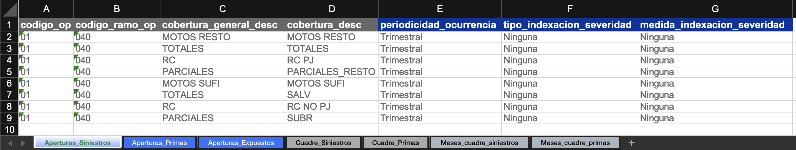
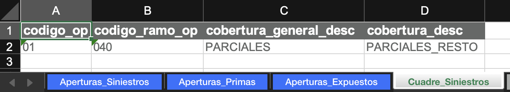
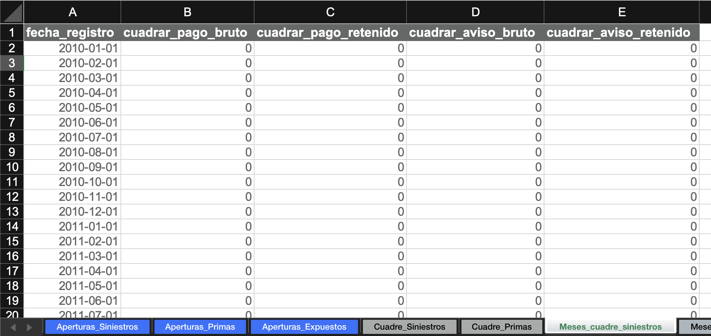

# El archivo segmentación

Este es un archivo de Excel con tres objetivos:

1. **Definir las aperturas** de siniestros, primas, y expuestos para el análisis.
2. **Parametrizar el cuadre contable** contra SAP (opcional).
3. **Almacenar tablas de aperturas** para cargar en _queries_ de Teradata (opcional).

!!! example "Ejemplos"
    Consulte ejemplos reales de [archivos de segmentación utilizados para los cierres contables](https://github.com/sebastobone/app-analisis-siniestralidad/tree/main/data/).

## Definir aperturas

### ¿Qué es una apertura?

Una **apertura** es un nivel de desagregación del producto a analizar.

!!! example "Ejemplo"
    En un seguro de salud, podría analizarse cada cobertura por separado (laboratorios, diagnósticos, cirugías) o agruparlas en categorías con comportamientos similares. En ese caso, decimos que estamos **"aperturando"** por cobertura.

### Tablas de aperturas

En el archivo de segmentación, cree las siguientes hojas con sus respectivas tablas de aperturas:

- **Apertura_Siniestros**
- **Apertura_Primas**
- **Apertura_Expuestos**

!!! warning "Advertencia"
    Cada tabla debe incluir obligatoriamente las columnas:

    - **codigo_op** (código de la compañía)
    - **codigo_ramo_op** (código del ramo)

    Estas columnas son necesarias para realizar las comparaciones contra SAP.

### Propiedades de cada apertura

En **Apertura_Siniestros**, para cada apertura se debe definir:

1. **Periodicidad de ocurrencia**: Granularidad del triángulo y del entremés. Valores disponibles: Mensual, Trimestral, Semestral, o Anual.

2. **Tipo de indexación de la severidad**: Metodología de indexación que se utilizará para calcular la severidad. Puede tomar tres valores: Ninguna, Por fecha de ocurrencia, o Por fecha de movimiento

3. **Medida de indexación de la severidad**: Nombre del indicador a usar para la indexación (si aplica).

!!! example "Ejemplo"
    

## Parametrizar el cuadre contable

!!! tip
    Si no realizará cuadre contable, puede omitir esta sección.

### Aperturas para repartir diferencias

Cree dos hojas:

1. **Cuadre_Siniestros**
2. **Cuadre_Primas**

En cada una incluya una tabla con las aperturas donde se repartirán las diferencias detectadas.

!!! note "Nota"
    Para entender la lógica de repartición, consulte la [guía de cuadre contable](../uso/controles.md#reparticion-de-diferencias-contables).

!!! example "Ejemplo"
    

### Meses y cantidades a cuadrar

Agregue dos hojas:

- **Meses_cuadre_siniestros**  
- **Meses_cuadre_primas**

Cada una debe tener una tabla con los todos los meses de movimiento esperados, y columnas para especificar si cada cantidad se va a cuadrar o no. En estas columnas indique con:

- **1** → se ajusta a la cifra contable.  
- **0** → no se ajusta.

!!! example "Ejemplo"
    

## Tablas para cargar en _queries_

!!! tip
    Si no va a extraer información de Teradata, omita esta sección.

Las tablas y el formato requerido se describen en la [guía de construcción de _queries_](queries.md#desde-el-archivo-segmentacion-camino-complejo).
