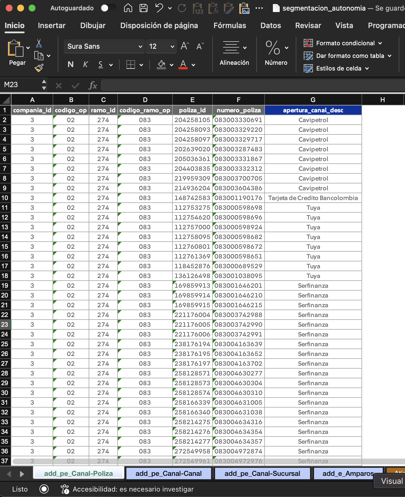

# Configuración

## Consultas o _queries_

Para realizar un análisis de triángulos o entremés y calcular una siniestralidad última, necesitamos contar con información de siniestros, primas, y expuestos. La principal forma de obtener esta información es a través de consultas de Teradata, las cuales serán almacenadas en la carpeta `data/queries`.

Los queries contenidos por defecto en esta carpeta son los que utiliza actualmente cada negocio para su proceso mensual de cierre de reservas. Si desea realizar un análisis diferente, modifique estos queries de tal forma que la salida que generen contenga, como mínimo, las siguientes columnas:

### Siniestros

- codigo_op
- codigo_ramo_op
- "columnas de aperturas" (por ejemplo: canal, amparo, tipo de vehículo, etc.)
- fecha_siniestro
- fecha_registro
- conteo_pago
- conteo_incurrido
- conteo_desistido
- pago_bruto
- pago_retenido
- aviso_bruto
- aviso_retenido

### Primas

- codigo_op
- codigo_ramo_op
- "columnas de aperturas" (pueden diferir de las columnas de aperturas de siniestros y expuestos)
- fecha_registro
- prima_bruta
- prima_bruta_devengada
- prima_retenida
- prima_retenida_devengada

### Expuestos

- codigo_op
- codigo_ramo_op
- "columnas de aperturas" (pueden diferir de las columnas de aperturas de siniestros y expuestos)
- fecha_registro
- expuestos
- vigentes

## Definición de aperturas

Para definir las aperturas sobre las cuales se calculará la siniestralidad última, se tienen dos alternativas:

1. Definir la apertura directamente desde el query. Este camino se recomienda si la apertura es sencilla y no depende de otras aperturas. Por ejemplo:

   ```sql
   CASE
       WHEN fas.clase_tarifa_cd IN (2, 3) THEN 'MOTOS'
       WHEN fas.clase_tarifa_cd IN (4, 5, 6) THEN 'UTILITARIOS'
       ELSE 'LIVIANOS'
   END AS tipo_vehiculo_desc
   ```

2. Definir la apertura desde el archivo `data/segmentacion.xlsx`. Este camino se recomienda si la apertura tiene una lógica compleja o depende de otras aperturas. Para ello, se deben seguir los siguientes pasos:

   1. Crear una nueva hoja en el Excel. El nombre de la hoja debe seguir el siguiente formato: `add_{indicador_cantidad}_{alias_apertura}`.

      `indicador_cantidad` admite tres posibles valores: `s` para siniestros, `p` para primas, y `e` para expuestos. Por ejemplo, si los siniestros se van a aperturar por amparo, el nombre de la hoja sería `add_s_Amparos`. Si tanto siniestros como primas y expuestos se van a aperturar por esta variable, el nombre sería `add_spe_Amparos`.

   2. Crear la tabla con la definicion de la apertura. A continuacion, se muestra un ejemplo:

      

      Las columnas grises de la imagen corresponden a las columnas como aparecen en Teradata, mientras que la columna azul oscura representa la definición de la apertura creada por el usuario.

   3. Al principio del query, crear una tabla volátil para recibir la tabla creada anteriormente. Siguiendo el mismo ejemplo:

      ```sql
      CREATE MULTISET VOLATILE TABLE canal_poliza
      (
          compania_id SMALLINT NOT NULL
          , codigo_op VARCHAR(100) NOT NULL
          , ramo_id INTEGER NOT NULL
          , codigo_ramo_op VARCHAR(100) NOT NULL
          , poliza_id BIGINT NOT NULL
          , numero_poliza VARCHAR(100) NOT NULL
          , apertura_canal_desc VARCHAR(100) NOT NULL
      ) PRIMARY INDEX (
          poliza_id, codigo_ramo_op, compania_id
      ) ON COMMIT PRESERVE ROWS;
      INSERT INTO CANAL_POLIZA VALUES (?, ?, ?, ?, ?, ?, ?);
      COLLECT STATISTICS ON canal_poliza INDEX (poliza_id, codigo_ramo_op, compania_id);
      ```

      Es importante, cuando cree este tipo de tablas, recolectar estadísticas (`COLLECT STATISTICS...`), de forma que la tabla pueda ser estudiada por el motor interno de Teradata y el query pueda ser optimizado.

   4. Utilizar la tabla en las consultas para definir la apertura.

      ```sql
      SELECT
          ...
          , COALESCE(p.apertura_canal_desc, 'RESTO') AS apertura_canal_desc
          ...

      FROM mdb_seguros_colombia.v_hist_polcert_cobertura AS vpc
      ...
      LEFT JOIN
          canal_poliza AS p
          ON
              vpc.poliza_id = p.poliza_id
              AND ramo.codigo_ramo_op = p.codigo_ramo_op
              AND cia.compania_id = p.compania_id

      WHERE ...
      GROUP BY ...
      ```

Las aperturas esperadas deben estar almacenadas en el archivo `data/segmentacion.xlsx`, en las hojas definidas como "Apertura_Siniestros", "Apertura_Primas", y "Apertura_Expuestos". Estas aperturas deben contener todas las aperturas que salen de los queries, pero no es necesario que las aperturas que salen de los queries contengan todas las aperturas que están en estas tablas. Por ejemplo, si en un rango de fechas en el que se va a hacer el análisis una de las aperturas no estaba a la venta, es posible que quede en la tabla pero no en la salida del query.

Adicionalmente, en la tabla "Apertura_Siniestros" se deben llenar dos columnas adicionales:

- **apertura_reservas**: Representa la llave única que identifica cada apertura, se debe construir como el concatenado de las demás columnas.
- **periodicidad_ocurrencia**: Representa la granularidad del triángulo y del entremés que se va a realizar para cada apertura. Puede tomar cuatro valores de periodicidad - Mensual, Trimestral, Semestral, o Anual.

Todas las tablas definidas en estas hojas de apertura deben contener las columnas codigo_op (código de la compañía) y codigo_ramo_op (código del ramo).

A modo de ejemplo, consulte el archivo `data/segmentacion_demo.xlsx`.
