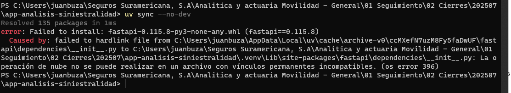
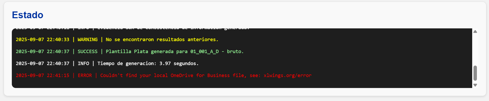

<!--markdownlint-disable MD024-->

# Preguntas frecuentes

## 1. Error de _hardlink_



### Descripción del problema

Este error ocurre porque los requisitos de paquetes para la instalación de la aplicación en la nube no coinciden con los que quedaron almacenados en la memoria del sistema a partir de instalaciones anteriores.

### Pasos para resolverlo

Limpie la memoria caché del administrador de paquetes ejecutando el siguiente comando:

```sh
uv cache clean
```

Una vez limpia la memoria, intente ejecutar nuevamente el comando que le generó el error.

## 2. Error de OneDrive/Sharepoint



### Descripción del problema

Este error ocurre cuando el **autoguardado** está activado en una plantilla de Excel almacenada en OneDrive o SharePoint. Las funcionalidades de la aplicación dependen en gran medida de la **ruta local del archivo**, pero al activarse el autoguardado, dicha ruta se transforma en una **URL**, lo que puede generar conflictos con ciertos comandos.

### Pasos para resolverlo

1. Desactive el autoguardado en la barra superior de Excel.
2. Presione el botón "guardar" en esta misma ubicación.
3. Cierre el archivo.

Una vez realizados estos pasos, intente ejecutar nuevamente el comando que estaba utilizando.

!!! warning "Advertencia"
    Recuerde guardar manualmente el archivo cada vez que realice cambios importantes en la estructura de la plantilla.
