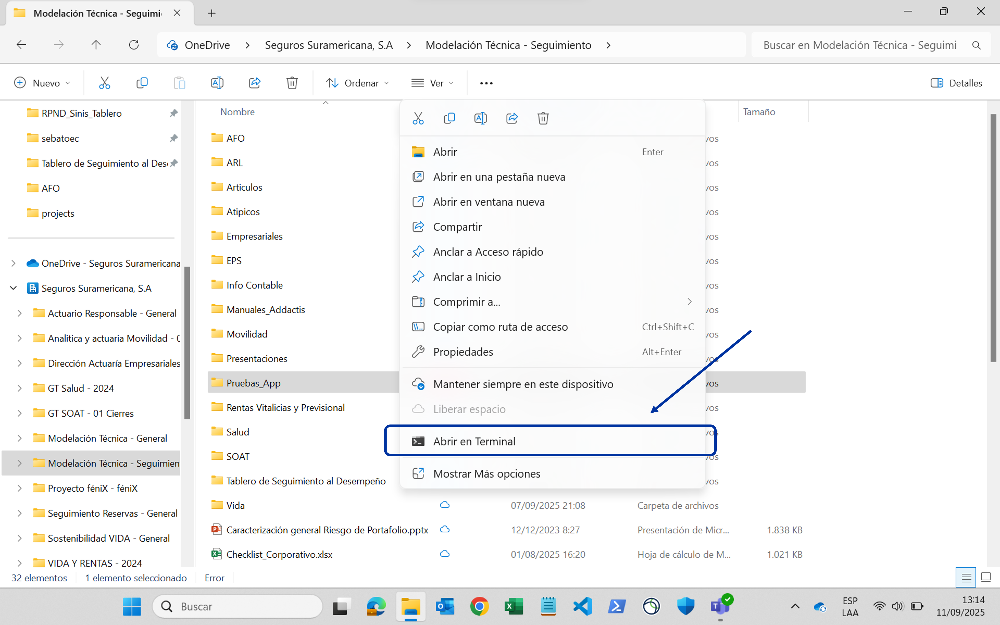

# Instalación

## Prerrequisitos

Para instalar la aplicación y empezarla a usar en un nuevo análisis, debe tener instalado previamente en su equipo [Git](https://git-scm.com/), [uv](https://docs.astral.sh/uv/getting-started/installation/), y Excel.

## Instrucciones

1. Cree una carpeta para almacenar el análisis.
2. Abra una terminal en esta carpeta. Para ello, seleccione la carpeta, presione click derecho, y seleccione abrir nueva terminal.

      

3. En la terminal, copie lo siguiente y presione enter:

      ```sh
      git clone https://github.com/sebastobone/app-analisis-siniestralidad.git
      cd app-analisis-siniestralidad
      uv sync
      ```

¡Eso es todo! Ahora puede proceder con la configuración del análisis. No cierre la terminal, la usará para ejecutar el proceso después.
