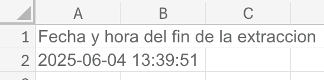
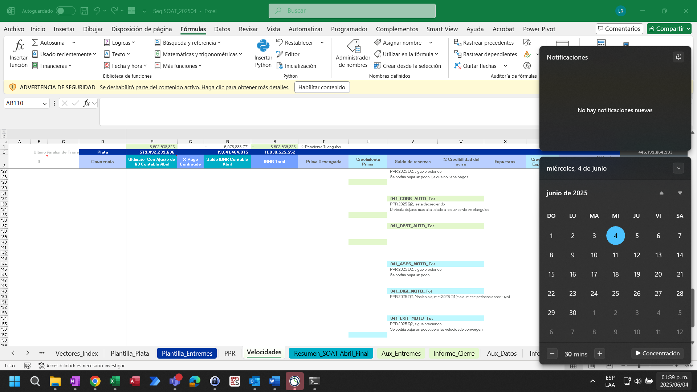

# Generación de controles

Para generar los controles de información, debe presionar el botón **"Generar controles"**. Tenga en cuenta que, al generar los controles, también se ejecutará el proceso de cuadre contable, con los parámetros establecidos en el archivo :material-file: `data/segmentacion_{negocio}.xlsx`.

Los resultados de estos controles se almacenan en la carpeta :material-folder: `data/controles_informacion`. Asimismo, esta carpeta cuenta con tres subcarpetas:

- :material-folder: `data/controles_informacion/pre_cuadre_contable`: contiene los controles sobre la información original extraída de Teradata.
- :material-folder: `data/controles_informacion/post_cuadre_contable`: contiene los controles sobre la información resultante después del proceso de cuadre contable.
- :material-folder: `data/controles_informacion/post_ajustes_fraude`: contiene los controles sobre la información resultante después del proceso de ajuste de fraude (solamente aplica para el ramo de SOAT).

Si no se aplica ningún proceso de cuadre contable, la carpeta `post_cuadre_contable` permanecerá vacía.

## Comparación entre las cifras de Teradata y SAP

Esta comparación solamente se realiza para primas y siniestros. Se realiza para cada periodo contable a nivel de ramo, pues esta es la apertura máxima que se puede lograr desde SAP. La diferencia se calcula en monto completo y en diferencia porcentual, tomando como referencia la cifra de SAP.

## Consistencia histórica

Esta validación consiste en comparar las cifras de la extracción actual contra la extracción del mes inmediatamente anterior, tanto para Teradata como para SAP. En el caso de Teradata, la comparación se hace al nivel de segmentación máximo (apertura + periodo de ocurrencia + periodo de movimiento), de forma que se pueda visualizar variaciones en la cifra total y cambios de ocurrencia o periodo de movimiento entre las diferentes extracciones.

## Evidencias de extracción

En la carpeta :material-folder: `controles_informacion`, se almacenan dos evidencias:

- El archivo de segmentación utilizado, con una hoja adicional donde se consigna la fecha y hora de fin del proceso de generación de controles.

    

- Un pantallazo donde se muestra la fecha y hora de fin del proceso de generación de controles.

    
