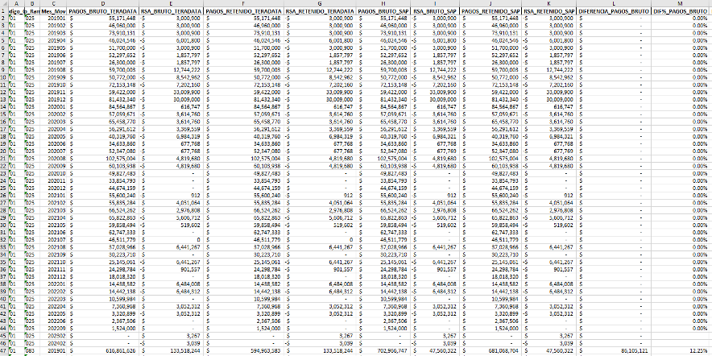

# Controles generados

## Comparación entre las cifras de Teradata y SAP

Esta comparación solamente se realiza para primas y siniestros. Se realiza para cada periodo contable a nivel de ramo, pues esta es la apertura máxima que se puede lograr desde SAP.

## Consistencia histórica

Esta validación consiste en comparar las cifras de la extracción actual contra la extracción del mes inmediatamente anterior, tanto para Teradata como para SAP. En el caso de Teradata, la comparación se hace al nivel de segmentación máximo (apertura + periodo de ocurrencia + periodo de movimiento), de forma que se pueda visualizar variaciones en la cifra total y cambios de ocurrencia o periodo de movimiento entre las diferentes extracciones.

## Evidencias de extracción

En la carpeta `controles_informacion`, se almacena el archivo de segmentación utilizado con una hoja adicional donde se consigna el número de filas resultante de la extracción de cada archivo, así como un pantallazo con la fecha y hora de fin del proceso de extracción.
