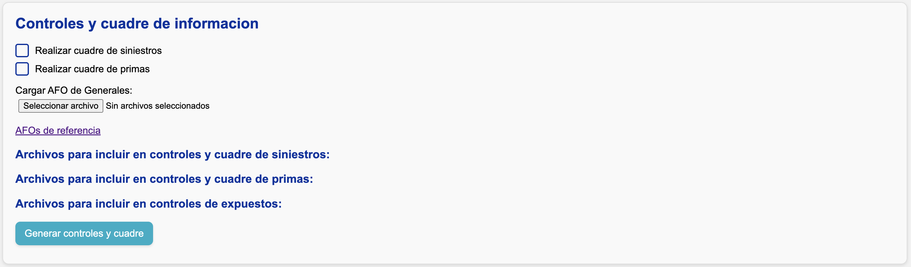
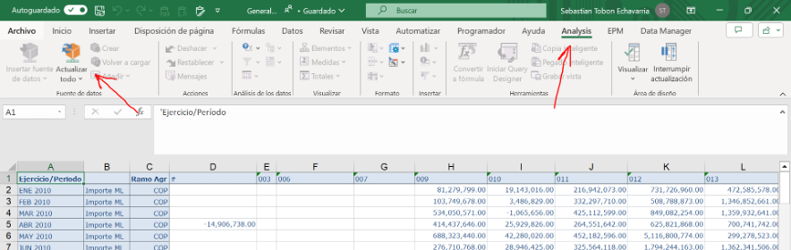

# Generar controles de información y cuadrar contablemente

Después de la sección **"Carga manual de información"**, verá la siguiente sección:

## Los archivos AFOs

Los "AFOs" son archivos de Excel que, mediante el complemento **Analysis For Office (AFO)**, muestran las cifras contables de cada mes para:

- **Primas**
- **Pagos de siniestros**
- **Movimientos de reserva de aviso**

Según las aperturas que haya definido en el [archivo de segmentación](../config/segmentacion.md), la aplicación le pedirá cargar los AFOs correspondientes.

!!! info "AFOs de referencia"
    En [**este enlace**](https://suramericana-my.sharepoint.com/:f:/g/personal/sebastiantobon_sura_com_co/ErrqzjH-aIRMsAgGij4ptPABWbknTTpJMxfBjFJPU6YIWQ?e=1dPTF6) encontrará los archivos AFO suministrados por Modelación Técnica para cada una de las compañías.

### Actualización de AFOs

Si tiene instalado el complemento **Analysis For Office**, puede actualizar los AFOs manualmente usando las funciones mostradas en la siguiente imagen:

## Cuadre contable

En la pantalla verá dos casillas de verificación (_checkboxes_) para indicar si desea realizar el **cuadre contable** de **siniestros y primas**. Si las activa, el sistema leerá y validará la parametrización de su [archivo de segmentación](../config/segmentacion.md#parametrizar-el-cuadre-contable).

### Repartición de diferencias contables

En la parte inferior, bajo los títulos **Archivos para incluir en controles y cuadre de siniestros, primas, y expuestos**, debe seleccionar qué archivos (ya sea de extracción o carga manual) se compararán contra SAP.

- El sistema calcula las diferencias a nivel de ramo-compañía y las reparte en las aperturas definidas en las hojas **Cuadre_Siniestros** y **Cuadre_Primas** del [archivo de segmentación](../config/segmentacion.md#aperturas-para-repartir-diferencias).
- Si especificó más de una apertura, la diferencia se reparte proporcionalmente a la participación de cada apertura en la cifra contable histórica.

!!! info
    Cada vez que extrae o carga un nuevo archivo de siniestros, primas, o expuestos, las listas de archivos disponibles se actualizan automáticamente.

!!! example "Ejemplo"
    Supongamos que el ramo **040** tiene una diferencia de $100 en el **pago bruto** para agosto 2025. Especificamos dos aperturas para repartir la diferencia:

    - **"Autos"**, con $300,000 pagados en toda la historia.
    - **"Motos"**, con $100,000 pagados en toda la historia.
    
    Para el cuadre contable, se asignarán $75 a "Autos" y $25 a "Motos" para agosto 2025.

!!! note "Nota"
    En el cuadre de siniestros, **toda la diferencia se asigna a la fecha de ocurrencia más reciente** dentro de cada fecha de registro.

### Almacenamiento de archivos

Los archivos quedan almacenados en:

- Datos originales → :material-folder: `data/pre_cuadre_contable`
- Datos cuadrados → :material-folder: `data/post_cuadre_contable`

## Controles de información

Si activa el cuadre contable, los controles se ejecutan **dos veces**:

1. Con la información **antes del cuadre**.
2. Con la información **después del cuadre**.

Los resultados se guardan en:

1. Pre-cuadre → :material-folder: `data/controles_informacion/pre_cuadre_contable`
2. Post-cuadre → :material-folder: `data/controles_informacion/post_cuadre_contable`

### Comparación entre las cifras de Teradata y SAP

Esta comparación solamente se realiza para **primas y siniestros**. Se compara cada cantidad en cada periodo contable a nivel de **ramo-compañía** (apertura máxima disponible desde SAP). La diferencia se calcula en valor absoluto y en porcentaje, tomando SAP como referencia.

#### Umbrales aceptados

Por defecto, el sistema alerta si detecta una diferencia **mayor al 5%** en alguna cifra para el **mes de corte**.

!!! note "Nota"
    Este umbral puede variar según las [características de cada negocio](../cierre/particularidades.md).

### Consistencia histórica

El sistema compara la extracción actual contra la del **mes anterior**, tanto para Teradata como para SAP.

Para Teradata, la comparación se hace al nivel más detallado: **apertura + periodo de ocurrencia + periodo de movimiento**. Esto permite identificar variaciones de montos totales y cambios en fechas de ocurrencia o movimiento.

!!! warning "Alerta"
    Para sacar el máximo provecho, asegúrese de guardar en :material-folder: `data/controles_informacion` los controles generados en procesos anteriores.

### Evidencias de extracción

En la carpeta :material-folder: `controles_informacion`, el sistema guarda dos evidencias:

1. **El archivo de segmentación utilizado**, con una hoja extra que incluye la fecha y hora de generación de controles.

    

2. **Un pantallazo** con la fecha y hora de generación de controles.

    
