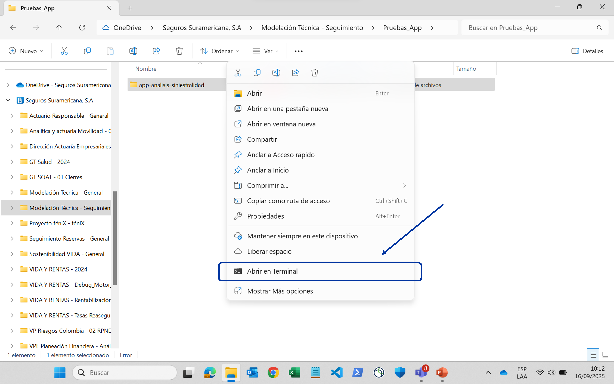

# Ejecutar la app

1. Abra la **carpeta de la aplicación** en una terminal:

    

2. En la terminal, copie y ejecute los siguientes comandos:

    ```sh
    uv sync
    uv run run.py
    ```

    Una vez finalicen, la terminal se verá así:

    

    !!! tip
        Si le sale un error al ejecutar estos comandos, consulte la solución en la [guía de problemas frecuentes](../faq.md).

    !!! note "Nota"
        Mantenga la terminal abierta mientras utiliza la aplicación.

3. Abra su navegador e ingrese la URL que aparece en la terminal (_INFO: Uvicorn running on..._). Debería ver una página como esta:

    

    !!! info
        Esta URL es local a su computador, por lo tanto, sólo usted puede acceder.
