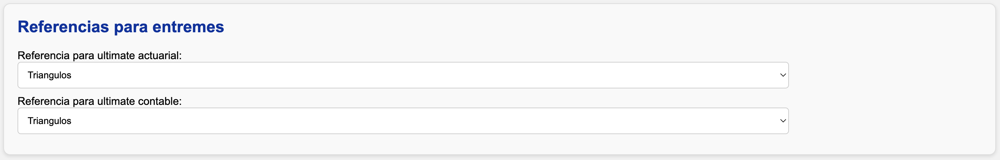

# Analizar entremés

La estimación de entremés se basa en la **siniestralidad última calculada para el mes inmediatamente anterior** al mes de corte definido.

!!! warning "Advertencia"
    Si no existe una estimación disponible para ese periodo, el sistema generará un error.

## Tipos de ocurrencia: anteriores vs. actuales

El análisis distingue entre dos tipos de ocurrencias:

- **Ocurrencias anteriores:** corresponden a periodos pasados cuya granularidad coincide con la del triángulo (por ejemplo, ocurrencias trimestrales).
- **Ocurrencias actuales:** corresponden a los meses dentro del periodo en curso, que aún no completan el número de meses de la granularidad completa.

!!! example "Ejemplo"
    Para una apertura con **trimestral**, con corte en **202505**:

    - Las **ocurrencias anteriores** incluyen todos los trimestres hasta **202503** (inclusive).
    - Las **ocurrencias actuales** abarcan los meses **202504** y **202505**, que forman parte del trimestre en curso.

## Estructura de la hoja de Entremés

Las columnas editables están sombreadas en **gris**.

### Información real

Contiene la misma información que la hoja **Resumen**: pagos, incurridos, conteos, expuestos y primas para todas las aperturas y periodos de ocurrencia.

### Ultimates anteriores

Incluye la frecuencia, severidad y siniestralidad última (actuarial y contable) del periodo anterior.

El origen de estas cifras depende de la referencia seleccionada en la sección **"Referencias entremés"** de la interfaz:

Puede elegirse de manera independiente para el **ultimate actuarial** y para el **contable**.

!!! example "Ejemplo"
    Si al corte anterior se calcularon triángulos pero el ultimate contabilizado se basó en entremés, se puede tomar de referencia actuarial los triángulos y de referencia contable el entremés.

### Metodologías de estimación

Cada ocurrencia puede estimarse con una de las siguientes metodologías. El color indica cómo se visualizan en la hoja.

#### 1. Completar diagonal (violeta)

- Solamente aplica para **ocurrencias anteriores**.
- Consiste en calcular un **factor de completitud** que estima cuánto falta para completar la diagonal en cada ocurrencia, usando como referencia triángulos con desarrollo mensual y ocurrencias con la granularidad de la apertura.
- Una vez se completa la diagonal, se aplica la misma velocidad de desarrollo calculada en los triángulos más recientes para la ocurrencia correspondiente.
- Por defecto, se utiliza un **promedio ponderado ventana de 4 periodos** para calcular el factor de completitud. Puede revisar y ajustar esta estimación desde la hoja **"Completar_diagonal"**.

##### La hoja "Completar_diagonal"

Funciona igual que las hojas de triángulos, pero llega sólo hasta la sección de estadísticos. Para más información sobre su uso, consulte la [guía de uso de triángulos](triangulos.md).

Esta hoja incluye una tabla resumen adaptada. En ella encontrará:

- Factores de completitud por ocurrencia para pago e incurrido.
- Porcentajes de desarrollo por ocurrencia para pago e incurrido, útiles para validar contra expectativas de negocio.

Una vez guardados los resultados, se actualizarán automáticamente los factores y porcentajes en la hoja **Entremés**.

#### 2: Bornhuetter-Ferguson (naranja)

- Solamente aplica para **ocurrencias anteriores**.
- Pondera los resultados de las metodologías 1 (completar diagonal) y 3 (porcentaje de siniestralidad) según el **porcentaje de desarrollo** de la ocurrencia. A menor desarrollo, mayor peso se asigna a la metodología 3.

#### 3: Porcentaje de siniestralidad (rojo)

- Aplica tanto para **ocurrencias anteriores** y **actuales**.
- Consiste en asignar directamente un **porcentaje de siniestralidad** para cada ocurrencia.
- Es la **metodología por defecto** para la ocurrencia del último mes.

#### 4: Prima pura de riesgo (aguamarina)

- Aplica tanto para **ocurrencias anteriores** y **actuales**.
- Estima la siniestralidad multiplicando una prima pura fija por el número de expuestos.

#### 5: Mantener

- Conserva la siniestralidad última del periodo anterior.
- Es la **metodología por defecto** para todas las ocurrencias que **no sean el último mes**.

### Frecuencia y Severidad

- **Frecuencia última**: por defecto se mantiene igual a la estimada en los triángulos más recientes.
- **Severidad última** se calcula por despeje (siniestralidad / conteo ultimate).

Ambos valores pueden modificarse manualmente.

### Gradualidad

Una vez estimada la siniestralidad última:

- El sistema calcula el **ajuste respecto al periodo anterior**.
- Para el ultimate contable, el usuario puede decidir aplicar **sólo un porcentaje** de ese ajuste. Esto se configura en las últimas columnas de la hoja.

### Otras columnas

- **Comentarios**: espacio para documentar los criterios, supuestos y justificaciones aplicados a cada ocurrencia.
- **Alertas (columnas amarillas)**: se activan cuando la metodología 1 (completar diagonal) difiere en más del 5% respecto al ultimate del periodo anterior. Estas alertas tienen fines de revisión y validación.

## Pasos finales

Los ultimates de la hoja **Resumen** están vinculados a los de la hoja **Entremés**. Puede guardar las fórmulas y criterios utilizados en el entremés para conservarlos en caso de que la información real se actualice.

- Para guardar los parámetros actuales, presione **Guardar fórmulas entremés**.
- Para recuperar dichos parámetros posteriormente, presione **Traer fórmulas entremés**.

## Análisis adicionales

Si desea realizar cálculos adicionales:

1. Copie la información desde la hoja **Resumen** o desde el archivo :material-file: `output/resultados.xlsx` a un nuevo archivo independiente.
2. Guarde el nuevo archivo en la carpeta :material-folder: `plantillas`.

!!! info
    Este archivo no será afectado por los procesos de la aplicación, por lo que puede modificarlo libremente sin riesgo de sobrescritura.
