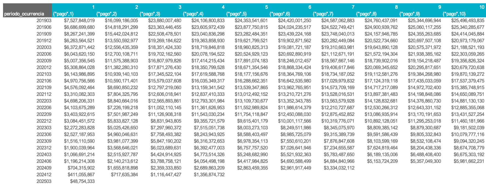
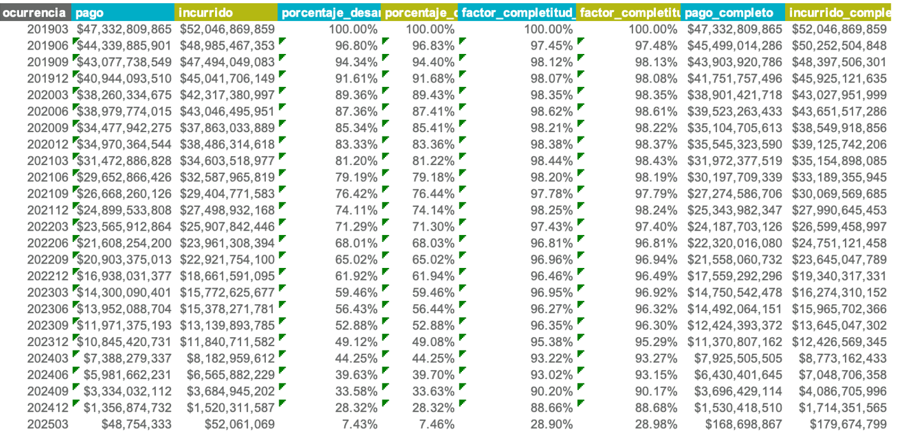

# Análisis de entremés

La estimación de entremés se basa en la siniestralidad última calculada para el mes inmediatamente anterior al mes de corte definido. Si no existe una estimación disponible para ese periodo, el sistema generará un error.

## Tipos de ocurrencia: anteriores vs. actuales

El análisis distingue entre dos tipos de ocurrencias, según su temporalidad:

- **Ocurrencias anteriores:** corresponden a periodos pasados cuya granularidad coincide con la del triángulo (por ejemplo, ocurrencias trimestrales).
- **Ocurrencias actuales:** corresponden a los meses dentro del periodo en curso, que aún no completan el número de meses de la granularidad completa.

### Ejemplo

Para una apertura con granularidad **trimestral**, con corte en **202505**:

- Las **ocurrencias anteriores** incluyen todos los trimestres hasta **202503** (inclusive).
- Las **ocurrencias actuales** abarcan los meses **202504** y **202505**, que forman parte del trimestre en curso.

## Preparación

Antes de ejecutar el análisis, siga estos pasos:

1. Presionar el botón **"Generar aperturas"**.
2. Presionar el botón **"Preparar plantilla"**.

## Estructura de la hoja de Entremés

Las columnas editables están sombreadas en **gris**.

### Información real

Contiene la misma información que la hoja **Resumen**: pagos, incurridos, conteos, expuestos y primas para todas las aperturas y periodos de ocurrencia.

### Ultimates anteriores

Incluye la frecuencia, severidad y siniestralidad última (actuarial y contable) del periodo anterior. Las cifras de plata dependen de los ultimates de referencia seleccionados en la sección ["Referencias entremés"](../uso/inicio.md) del frontend.

### Metodologías de estimación

#### 1. Completar diagonal (violeta)

Aplica únicamente para **ocurrencias anteriores**. Consiste en calcular un **factor de completitud** que estima cuánto falta para completar la diagonal en cada ocurrencia, usando como referencia triángulos con desarrollo mensual y ocurrencias con la granularidad de la apertura. Una vez se completa la diagonal, se aplica la misma velocidad de desarrollo calculada en los triángulos más recientes para la ocurrencia correspondiente.

Por defecto, se utiliza un **promedio ponderado ventana de 4 periodos** para calcular el factor de completitud. Puede revisar y ajustar esta estimación desde la hoja **"Completar_diagonal"**.

##### La hoja "Completar_diagonal"

Esta hoja funciona como los triángulos tradicionales, pero limitada hasta la sección de estadísticos, y con una tabla resumen adaptada.

Para más información sobre su uso, consulte la [documentación de triángulos](triangulos.md).

En la tabla resumen de esta hoja encontrará:

- Factores de completitud por ocurrencia para pago e incurrido.
- Porcentajes de desarrollo por ocurrencia para pago e incurrido, útiles para validar contra expectativas de negocio.

Una vez guardados los resultados, se actualizarán automáticamente los factores y porcentajes en la hoja **Entremés**.

#### 2: Bornhuetter-Ferguson (naranja)

Aplica únicamente para **ocurrencias anteriores**. Combina los resultados de las metodologías 1 (completar diagonal) y 3 (porcentaje de siniestralidad), ponderándolos según el **porcentaje de desarrollo** de cada ocurrencia. A menor desarrollo, mayor peso se asigna a la metodología 3.

#### 3: Porcentaje de siniestralidad (rojo)

Aplica tanto para **ocurrencias anteriores** y **actuales**. Consiste en asignar directamente un **porcentaje de siniestralidad** para cada ocurrencia. Es la metodología por defecto para la ocurrencia del último mes.

#### 4: Prima pura de riesgo (aguamarina)

También aplicable a **ocurrencias anteriores** y **actuales**. Estima la siniestralidad multiplicando una prima pura fija por el número de expuestos.

#### 5: Mantener

Esta metodología conserva la siniestralidad última estimada en el periodo anterior sin realizar ajustes adicionales. Es la metodología por defecto para todas las ocurrencias que no sean el último mes.

### Frecuencia y Severidad

Por defecto:

- La **frecuencia última** se mantiene igual a la estimada en los triángulos más recientes.
- La **severidad última** se calcula por despeje (siniestralidad / conteo ultimate).

Ambas estimaciones pueden modificarse libremente por el usuario.

### Gradualidad

Una vez calculada la siniestralidad última, se determina el ajuste respecto al periodo anterior. Si para el ultimate contable desea aplicar sólo un porcentaje del ajuste (y no el 100%), puede configurarlo desde las últimas columnas de la hoja.

### Otras columnas

- **Comentarios**: espacio para documentar los criterios, supuestos y justificaciones aplicados a cada ocurrencia.
- **Alerta**: columnas de **color amarillo** que se activan cuando la metodología 1 genera una diferencia superior al 5% respecto al ultimate del periodo anterior. Estas alertas tienen fines de revisión y validación.

## Pasos finales

Por defecto, los ultimates de la hoja **Resumen** están vinculados dinámicamente a la hoja **Entremés**. Sin embargo, puede guardar las fórmulas y criterios utilizados en el entremés para conservarlos en caso de que la información real se actualice.

- Para guardar los parámetros actuales, presione el botón **"Guardar formulas entremes"**.
- Para recuperar dichos parámetros posteriormente, presione **"Traer formulas entremes"**.

## Análisis adicionales

Si desea realizar análisis adicionales sobre los resultados de la estimación, puede copiar la información desde la hoja **Resumen** o desde el archivo :material-file: `output/resultados.xlsx` a un nuevo archivo independiente, y guardarlo en la carpeta :material-folder: `plantillas`. Este archivo no será afectado por los procesos de la aplicación, por lo que puede modificarlo libremente sin riesgo de sobrescritura.
