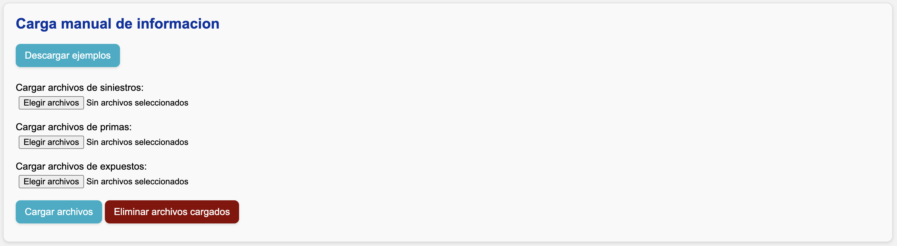

# Carga manual de información

Cuando presione **"Guardar parámetros"**, aparecerá la sección **"Carga manual de información"**:

Aquí puede cargar manualmente información de **siniestros, primas, y expuestos**.

## Pasos

1. Presione el botón **"Descargar ejemplos"**.

    - Se descargará una carpeta comprimida con ejemplos de cada archivo.
    - Úselos como referencia para construir la información que desea cargar.

2. Presione el botón **"Elegir archivos"**.

    - Puede elegir uno o varios archivos al mismo tiempo.
    - Los formatos admitidos son:
        - `.xlsx`
        - `.csv` (con cualquier tipo de separador)
        - `.txt` (con cualquier tipo de separador)
        - `.parquet`

3. Presione el botón **"Cargar archivos"**.

    - Los archivos cargados serán almacenados en la carpeta :material-folder: `data/carga_manual`.

!!! tip
    En los ejemplos sugeridos, las fechas corresponden siempre al primer día del mes. No es obligatorio que lo cargue así: el único requisito es que la columna esté en formato fecha. El sistema hará la mensualización automáticamente.

## Validaciones sobre los archivos cargados

Cada archivo cargado se somete a las [validaciones comunes](validaciones.md) sobre insumos de siniestros, primas, y expuestos.

Los datos cargados manualmente se almacenan en :material-folder: `data/carga_manual`.
