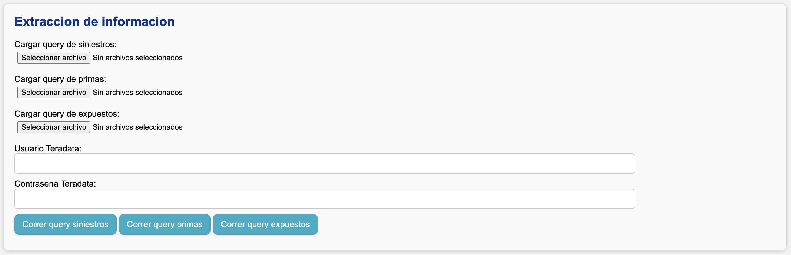

# Extracción de información

Cuando presione **"Guardar parámetros"**, aparecerá la sección **"Extracción de información"**:

## Pasos

1. Verifique que esté conectado a la **VPN o red +SURA**.
2. Cargue las consultas que construyó según la [guía de construcción de consultas](../../config/queries.md).

    - Una vez cargadas, las consultas quedarán almacenadas en la carpeta :material-folder: `data/queries/{negocio}`.

3. Ingrese su usuario y contraseña de Teradata.
4. Ejecute los queries.

    !!! tip
        Puede ejecutar varios queries al mismo tiempo. El estado de avance de cada uno se muestra en la sección **Estado**.

## Validación de tablas de segmentación

Si sus consultas utilizan **tablas de segmentación** definidas en el [archivo de segmentación](../../config/segmentacion.md), la aplicación valida automáticamente:

- Que las tablas estén nombradas correctamente, según el estándar descrito en [la guía de construcción de queries](../../config/queries.md#desde-el-archivo-segmentacion-camino-complejo).
- Que haya el número de tablas requerido por la consulta.
- Que cada tabla tenga el número correcto de columnas.
- Que las columnas coincidan con los tipos de datos definidos en la consulta.
- Que no existan registros duplicados. Si los hay, se eliminan y se genera una alerta.
- Que no haya valores nulos.

Si alguna validación falla, el sistema mostrará un mensaje de error. Tendrá que corregir la tabla correspondiente y volver a ejecutar la consulta.

## Validaciones sobre salidas

El resultado de cada consulta se somete a las [validaciones comunes](validaciones.md) sobre insumos de siniestros, primas, y expuestos. Los datos quedan almacenados en :material-folder: `data/raw`.
