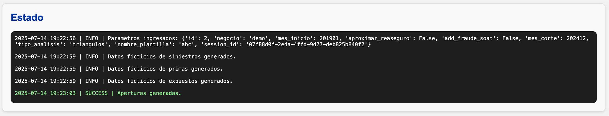
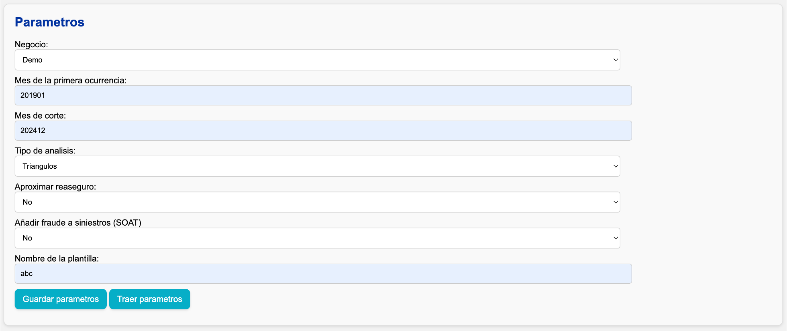
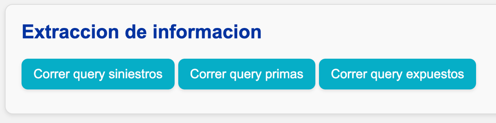
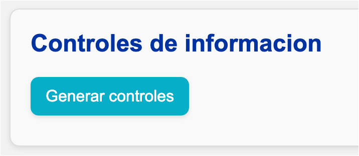
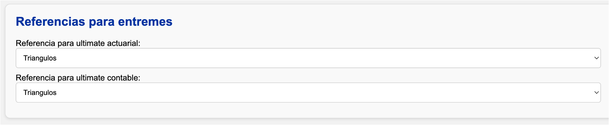
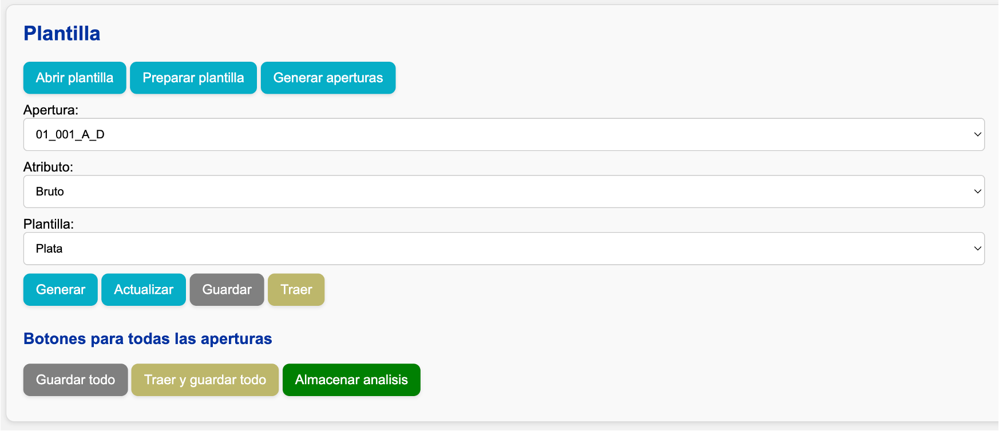
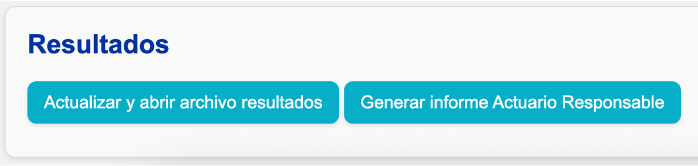

# Iniciar la aplicación

Escriba la siguiente línea en la terminal y presione _enter_:

```sh
uv run run.py
```

El comando anterior iniciará la aplicación en el [localhost](http://127.0.0.1:8000). Utilice el navegador para dirigirse a esa ruta.

## Estructura del frontend

### Estado

En esta sección se le informará sobre el progreso de las operaciones que ejecute en la aplicación, así como de posibles errores que se generen y notificaciones de interés.



### Parámetros

En esta sección ingresará los parámetros con los que se ejecutará el análisis.



### Extracción de información

En esta sección se encuentran los botones para ejecutar los queries de siniestros, primas, y expuestos; de acuerdo a la configuración que especificó en el archivo `data/segmentacion_{negocio}.xlsx`. Si presiona los tres botones uno tras del otro, los queries se ejecutarán en paralelo.



### Controles de información

Este botón generará los archivos con los controles de información, las evidencias respectivas, y le informará (en la ventana de Estado) sobre las diferencias más significativas en primas y siniestros.



### Referencias para entremés (sólo entremés)

En esta sección se puede seleccionar cuál es el ultimate que se va a tomar de referencia para hacer el análisis de entremés, en caso de que para el mes anterior existan resultados tanto de triángulos como de entremés.

Esta selección se puede hacer tanto para el ultimate actuarial como para el contable. Por ejemplo, si se tienen resultados de triángulos a corte del mes anterior pero el ultimate contabilizado es el que fue calculado con el entremés, se puede tomar de referencia actuarial los triángulos y de referencia contable el entremés.



### Plantilla

En esta sección se encuentran los comandos para interactuar con las plantillas de Excel donde se desarrolla el análisis de la siniestralidad última.



### Resultados

Los botones de esta sección permiten consolidar los resultados del análisis realizado en las plantillas y generar los informes relevantes (ejemplo: Actuario Responsable).


