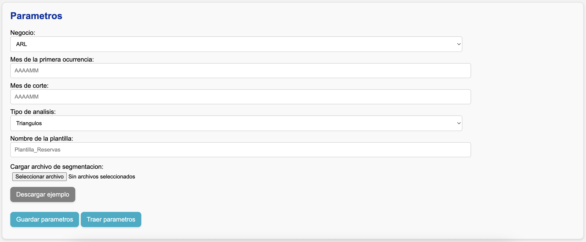

# Ingresar parámetros

En la interfaz web verá la sección **"Parametros"**:

## Pasos

!!! tip "¿Retomando un análisis que ya comenzó?"
    Presione el botón **Traer parámetros** para no tener que ingresar cada parámetro otra vez.

1. En el campo **Negocio**, seleccione el negocio que desea analizar. Esto define qué archivo de segmentación y qué _queries_ usar.

    !!! info "Negocios especiales"
        Hay dos negocios especiales: **"Demo"** y **"Custom"**.

        - El negocio **"Demo"** le permite hacer ejercicios de familiarización y exploración de las plantillas de Excel con información ficticia.
        - El negocio **"Custom"** le permite hacer un ejercicio con un negocio diferente a las líneas de negocio tradicionales.

2. En **Mes de la primera ocurrencia**, escriba (en formato **YYYYMM**) el mes de la primera ocurrencia de los triángulos o entremés.

    !!! note "Ocurrencias anteriores"
        Si en la información de siniestros, primas, o expuestos se encuentran meses anteriores a este, las cifras se agruparán en este primer mes con el objetivo de garantizar una correcta comparación contra SAP.

3. En **Mes de corte**, escriba (en formato **YYYYMM**) el mes de corte de la información.
4. En **Tipo de análisis**, elija entre **Triángulos** o **Entremés**.
5. En **Nombre de la plantilla**, escriba el nombre del archivo de Excel donde se hará el análisis.

    !!! tip
        En un mismo análisis puede utilizar múltiples plantillas. Todas son almacenadas en la carpeta :material-folder: `plantillas`.

6. En **Cargar archivo de segmentación**, cargue el [archivo de segmentación](../config/segmentacion.md) que construyó. Si no tiene uno, presione el botón **Descargar ejemplo** para obtener un archivo guía.
7. Presione el botón **Guardar parámetros**.

## Validaciones sobre el archivo de segmentación

Al presionar **Guardar parámetros**, la aplicación valida automáticamente:

- Que existan todas las hojas de aperturas.
- Que existan todas las columnas necesarias en las hojas de aperturas.
- Que no haya aperturas duplicadas.
- Que las periodicidades de ocurrencia y tipos de indexación de la severidad sean válidas.
- Que se haya definido una medida de indexación cuando corresponda.
- Que las aperturas de siniestros, primas, y expuestos sean consistentes entre sí.

Si alguna validación falla, el sistema generará un error y se lo mostrará en la sección **Estado**. Tendrá que corregir el archivo y volverlo a cargar.
