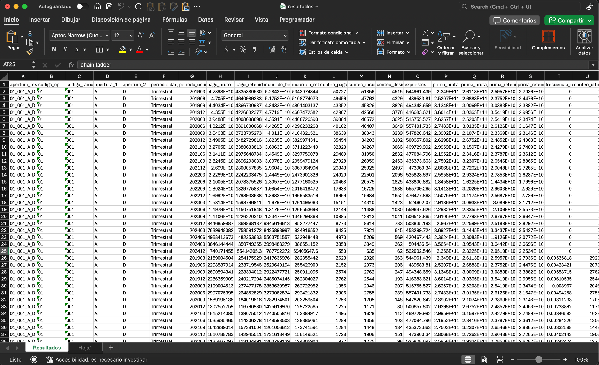

# Consolidación de resultados

El botón **"Actualizar y abrir archivo de resultados"** concatena todos los archivos ubicados en la carpeta :material-folder: `output/resultados` y copia su contenido en la hoja **"Resultados"** del archivo :material-file: `output/resultados.xlsx`.

- Si el archivo no existe, se creará automáticamente en la carpeta :material-folder: `output`.
- Si el archivo ya existe, se sobrescribirá únicamente la hoja **"Resultados"**. Todas las demás hojas, en caso de existir, permanecerán sin cambios.

En caso de que la carpeta :material-folder: `output/resultados` contenga múltiples archivos con resultados de la misma apertura para el mismo mes y tipo de análisis, el sistema conservará únicamente la estimación más reciente en el archivo :material-file: `output/resultados.xlsx`. Las demás serán ignoradas.
