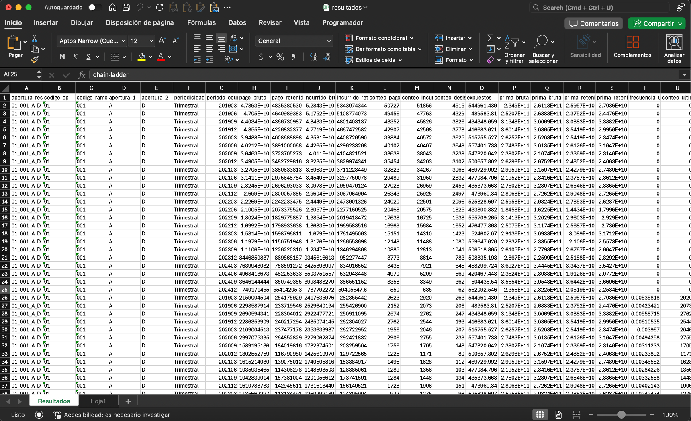

# Resultados e informes

Después de la sección **"Plantilla"**, verá la siguiente sección:

## Consolidación de resultados

El botón **Actualizar y abrir archivo de resultados** reúne toda la información de la carpeta :material-folder: `output/resultados` en un único archivo :material-file: `output/resultados.xlsx`.

- Si el archivo no existe, se creará automáticamente en la carpeta :material-folder: `output`.
- Si el archivo ya existe, se sobrescribirá únicamente la hoja **"Resultados"**. Todas las demás hojas, en caso de existir, permanecerán sin cambios.

!!! warning "Resultados duplicados"
    En caso de que la carpeta :material-folder: `output/resultados` contenga múltiples archivos con resultados de la misma apertura para el mismo mes y tipo de análisis, el sistema conservará **sólo la estimación más reciente**. Las demás serán ignoradas.

## Generación de informes

### Informe Actuario Responsable

El botón **Generar informe Actuario Responsable** genera este informe y lo almacena en la carpeta :material-folder: `output`.

