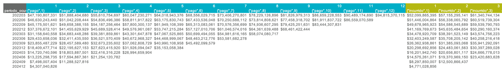
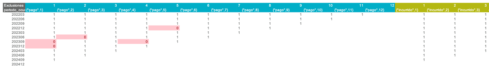
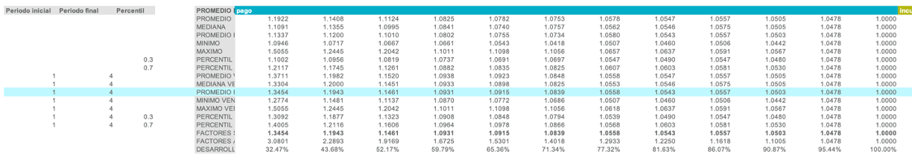
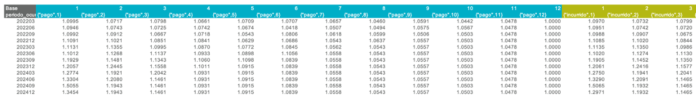
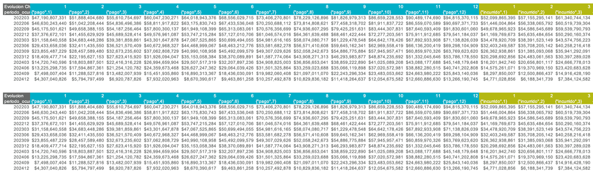
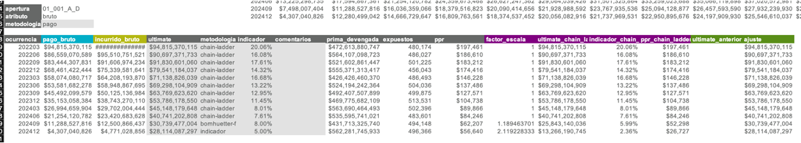

# Análisis de triángulos

Existen dos caminos para hacer la estimación por triángulos:

1. **Frecuencia y severidad**: Calcula la siniestralidad última como el producto de las dos cantidades.
2. **Plata**: Calcula la siniestralidad última directamente.

El proceso será descrito a través de una estimación de plata, pero es completamente análogo para la frecuencia y la severidad. Tenga en cuenta que la estimación de triángulos se debe realizar apertura por apertura.

## Preparación

1. Presionar el botón **"Generar aperturas"**.
2. Presionar el botón **"Preparar plantilla"**.
3. Seleccionar en las listas desplegables la apertura y el atributo deseados, y seleccionar la plantilla "Plata".
4. Presionar el botón **"Generar"**.

## Estructura de la hoja de análisis

### Triángulos acumulados

Para el cálculo de la frecuencia/severidad/siniestralidad última, se desarrolla el triángulo de pagos o incurridos por medio del método Chain Ladder. Este método organiza la información en forma de triángulo, donde cada fila representa un período de tiempo específico denominado "ocurrencia”. Cada columna del triángulo corresponde a una "altura", que es el período de tiempo transcurrido desde la fecha de ocurrencia del siniestro hasta la fecha de pago (en el caso de triángulos de pago) o hasta la fecha de aviso (en el caso de triángulos de incurridos).

En la parte superior de la hoja se puede observar la información de pagos e incurrido en forma de triángulos acumulados. La información de pagos está demarcada por el color azul, mientras que la de incurrido (a la derecha) está demarcada por el color amarillo.

### Ratios

La parte fundamental del método Chain-Ladder son los factores de desarrollo, los cuales representan cuantitativamente la tasa de evolución de la cifra de pagos o incurrido entre una altura y la siguiente. Estos factores de desarrollo se pueden observar en el triángulo de **“Ratios”**.

La estrategia clave en el método Chain-Ladder consiste en seleccionar de forma adecuada los factores de desarrollo que se utilizarán  para proyectar los periodos faltantes del triángulo. Para cada altura del triángulo debe definirse un factor de desarrollo específico. Estos factores pueden calcularse utilizando distintos estadísticos, como el promedio, la mediana, el máximo o el mínimo, entre otros.

### Exclusiones

En algunos casos, pueden presentarse factores atípicos debido a condiciones de negocio o fenómenos específicos que alteran su comportamiento respecto al resto de la altura. Para excluir estos valores del cálculo, se utiliza el triángulo de **“Exclusiones”**, donde el usuario debe marcar con un 0 aquellos factores que no deben ser considerados en el análisis. Los factores no excluidos deben dejarse con el valor por defecto (1).

### Estadísticos

Después del triángulo de “Exclusiones”, se presenta una sección con todos los estadísticos disponibles para el cálculo de factores de desarrollo. En el extremo izquierdo de esta sección se encuentran las **ventanas temporales** asociadas a cada estadístico, las cuales pueden ser modificadas por el usuario según el criterio de estimación que desee aplicar.

Por defecto, el estadístico utilizado es el **promedio ponderado ventana**, aunque puede cambiarse desde la celda ubicada en la primera fila de esta sección. El estadístico seleccionado se resaltará en azul claro para facilitar su identificación.

Si se requiere aplicar una lógica distinta para una altura específica, es posible modificar manualmente la fórmula en la fila denominada **“factor seleccionado”**, que es la que se utiliza en el cálculo final del triángulo proyectado.

### Triángulo base

Posteriormente, encontrará el triángulo **"Base"**, el cual permite modificar los factores de desarrollo seleccionados celda por celda. Esto es útil en casos donde, por ejemplo, se quiere seleccionar factores diferentes para una ocurrencia particular.

### Triángulos desarrollados

Los últimos dos triángulos que encontrará son los que ya tienen los periodos faltantes completos:

- **"Evolucion Chain-Ladder"**: Es el triángulo evolucionado con los factores seleccionados.
- **"Evolucion"**: Es el triángulo evolucionado con los factores seleccionados, pero reescala las ocurrencias donde se seleccionó una metodología diferente a Chain-Ladder. Este triángulo representa el resultado final del análisis.

### Tabla resumen

A continuación de los triángulos, se encuentra la tabla resumen de resultados. Las celdas con **fondo gris** son **paramétricas**, lo que significa que pueden ser modificadas libremente por el usuario.

Por defecto, las estimaciones se basan en el **pago**. Si se desea utilizar la metodología basada en **incurrido**, basta con escribir la palabra "incurrido" en la celda ubicada en la esquina superior izquierda de esta sección.

#### Metodologías alternativas

Aunque por defecto todas las ocurrencias se estiman utilizando la metodología Chain-Ladder, existen dos metodologías alternativas disponibles:

1. **Indicador**: Esta opción permite estimar la frecuencia, severidad o siniestralidad última a partir de un valor especificado en la columna "indicador".
    - Para frecuencia y severidad, el indicador representa directamente el valor esperado.
    - Para el caso de siniestralidad (plata), el indicador es un porcentaje de siniestralidad, que se aplica sobre la prima devengada.
    - Para activar esta metodología, escriba "indicador" en la columna "metodología" correspondiente a la ocurrencia deseada.

2. **Bornhuetter-Ferguson**: Esta opción combina los resultados de Chain-Ladder e Indicador, ponderándolos según el **porcentaje de desarrollo de la ocurrencia**. A menor desarrollo, mayor peso se da al indicador.
    - Para activar esta metodología, escriba "bornhuetter-ferguson" en la columna "metodología" correspondiente.

La tabla incluye también columnas informativas de referencia para apoyar la estimación, como "indicador chain-ladder", "expuestos", entre otras.

Por último, la columna "comentarios" está disponible para que el usuario registre los criterios, decisiones y justificaciones aplicadas en la estimación de cada ocurrencia.

## Pasos finales

Una vez terminada la estimación, presione el botón **"Guardar"**. La siguiente información será almacenada en la carpeta :material-folder: `data/db`:

- Triángulo de factores excluidos
- Ventanas de tiempo para estadísticos
- Vector de factores seleccionados
- Triángulo base
- Metodología de pago o incurrido
- Ultimate por ocurrencia
- Metodología por ocurrencia
- Indicador por ocurrencia
- Comentarios por ocurrencia

A continuación, podrá realizar nuevas aperturas según sus necesidades:

- Para analizar una nueva apertura **desde cero**, seleccione la apertura deseada en la lista desplegable y presione el botón **"Generar"**. Esto cargará la configuración por defecto.
- Para analizar una nueva apertura **manteniendo los parámetros y criterios actuales**, seleccione la apertura en la lista desplegable y presione el botón **"Actualizar"**. Esto conserva la configuración vigente como punto de partida.
- Si ha finalizado todos los análisis y validaciones, y desea consolidar la información final, presione el botón **"Almacenar análisis"**.

## Modificar un análisis ya guardado

Para editar un análisis previamente guardado, siga estos pasos:

1. Seleccione la apertura y el atributo correspondientes desde las listas desplegables.
2. Presione el botón **"Traer"** para cargar los datos almacenados.
3. Realice las modificaciones necesarias.
4. Una vez finalizadas, presione nuevamente el botón **"Guardar"** para actualizar el análisis.

## Análisis adicionales

Si desea realizar análisis adicionales sobre los resultados de la estimación, puede copiar la información desde la hoja **Resumen** o desde el archivo :material-file: `output/resultados.xlsx` a un nuevo archivo independiente, y guardarlo en la carpeta :material-folder: `plantillas`. Este archivo no será afectado por los procesos de la aplicación, por lo que puede modificarlo libremente sin riesgo de sobrescritura.
